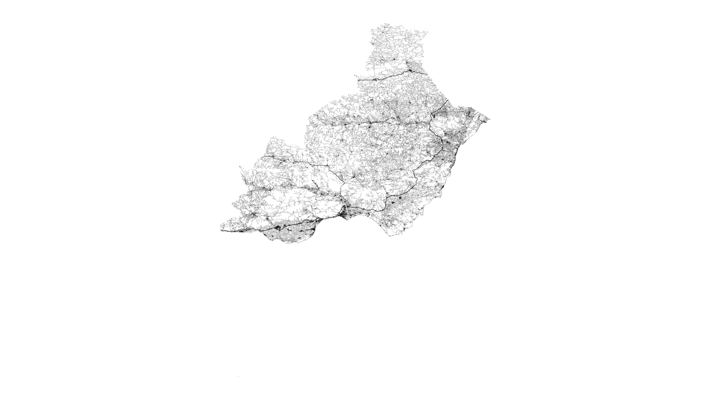
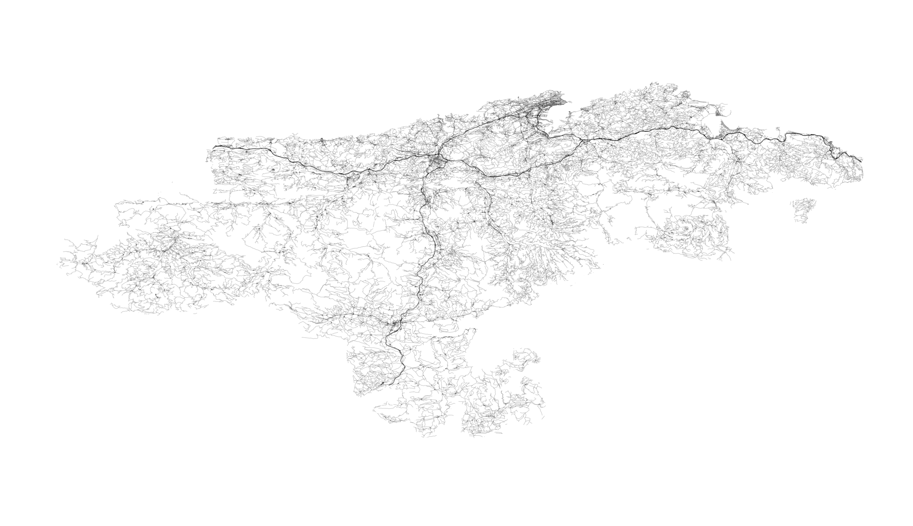
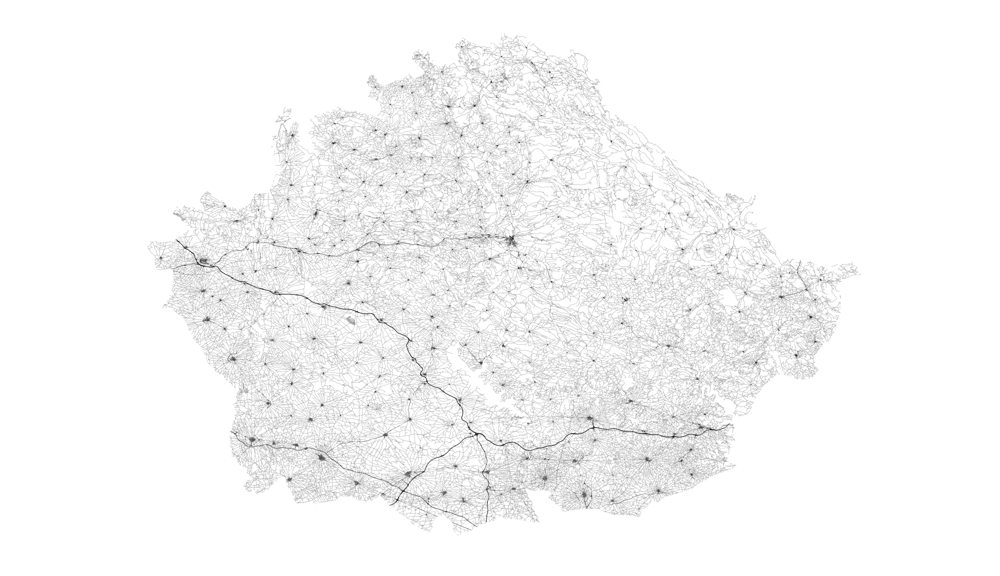
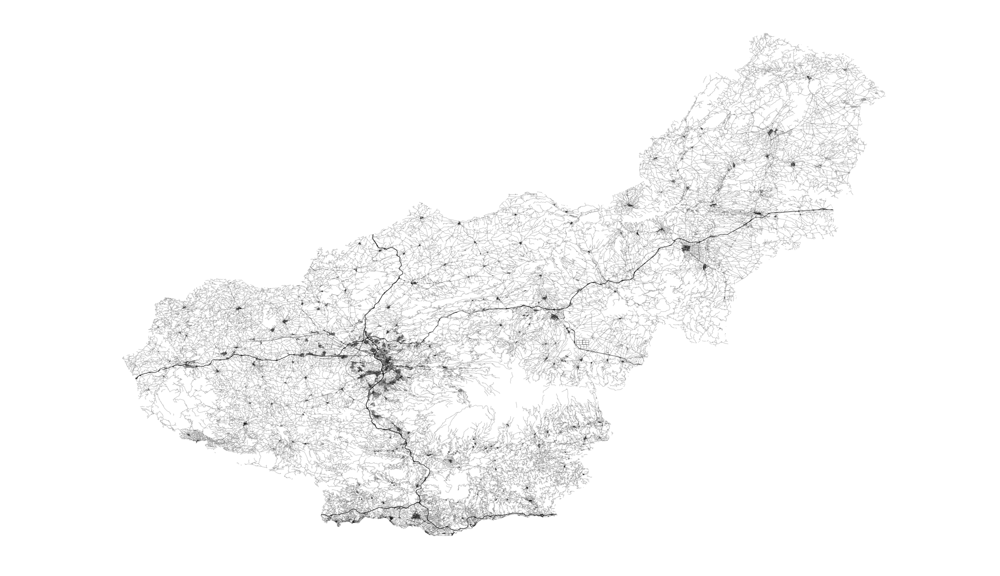
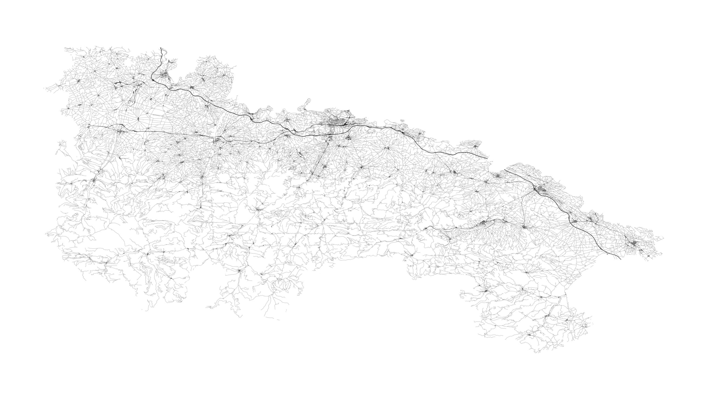
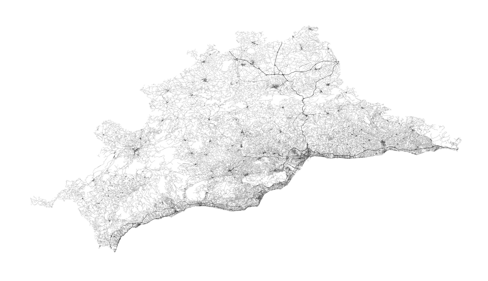
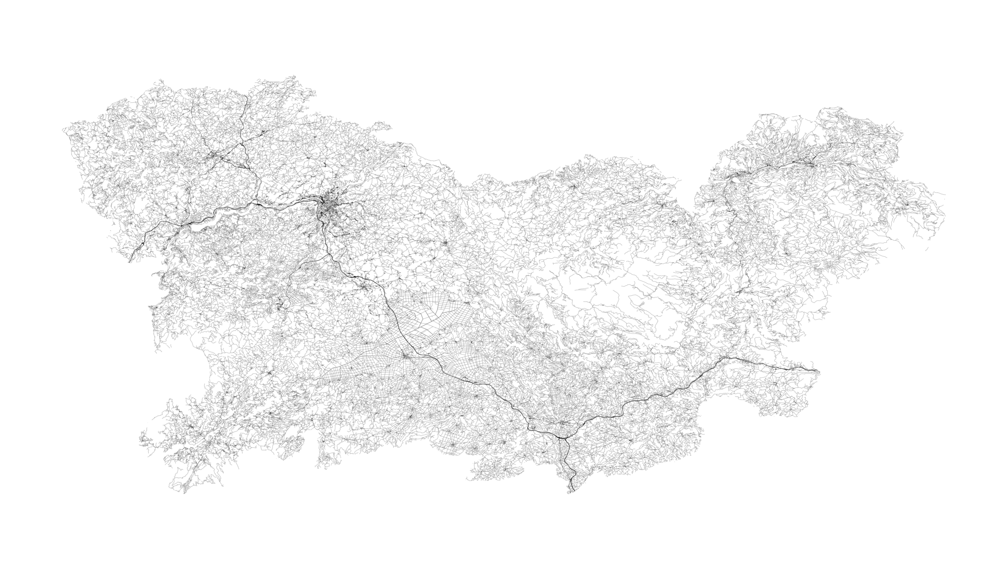
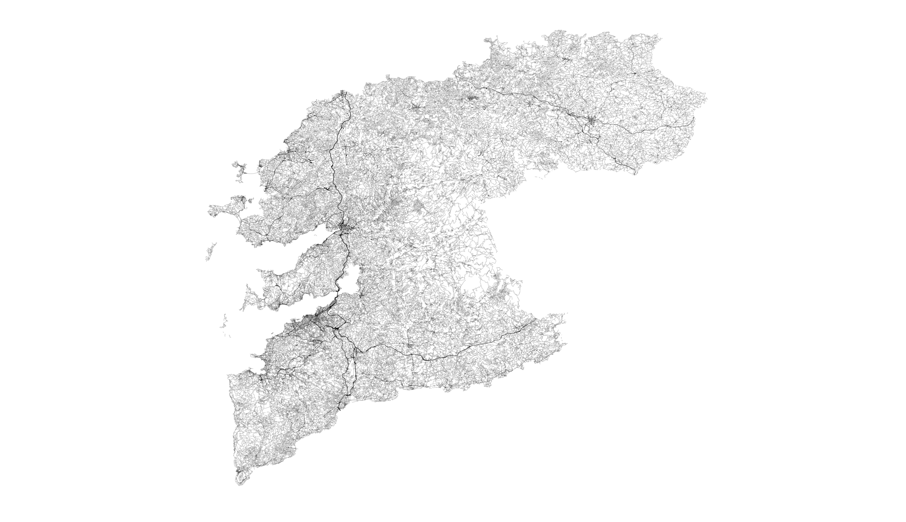
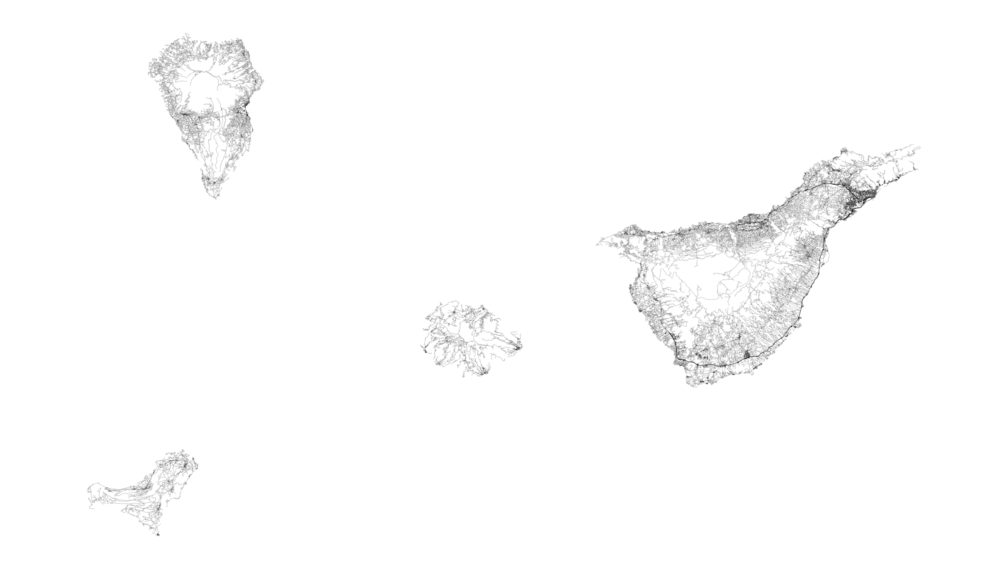
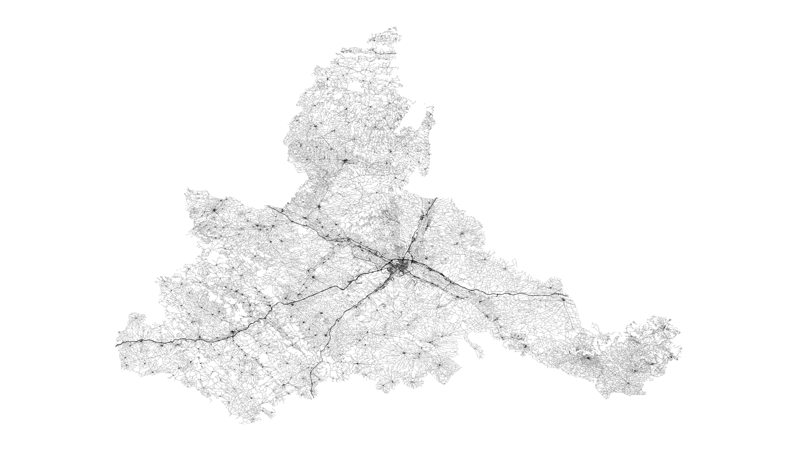

# spain-roads

Visualization of Spain roads at country level and province level.

Made with [Python 3.6.8](https://www.python.org/), [Geopandas 0.5.0](http://geopandas.org/) and [Matplotlib 3.1.0](https://matplotlib.org/). 

It reached the top of r/MapPorn! ==> [Reddit post](https://www.reddit.com/r/MapPorn/comments/c6wjsq/all_roads_and_streets_in_spain/)

## Data Sources

- Spain Border Shapefile: [DIVA-GIS](https://www.diva-gis.org/gdata)
- Spain Roads: [Centro Nacional de Información Geográfica](http://centrodedescargas.cnig.es/CentroDescargas/index.jsp#)

## Visualizations

### Country Level
[Full resolution image](figures/spain.jpg)

___

### Provinces

